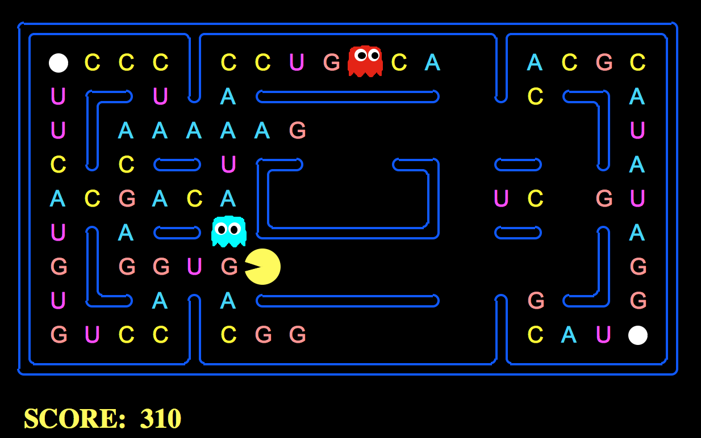

# Explaining how Hidden Markov Models can predict protein structure work using Pac-Man!

The DNA Pac-Man game (https://github.com/HussainAther/dnapacman) can represent how protein sequences are generated (using Hidden Markov Models). We can draw an analogy of how HMMs work in the context of generating protein sequences using the Pac-Man. The next token/letter you eat is the next letter in the sequence of generating a sequence of protein amino acids. 

Essentially, if we organize regions of the Pac-Man board representing different hidden states in a Markov Model, then the next letter that Pac-Man eats can represent the next state an HMM selects. We can change the probabilities a certain letter may appear and, when Pac-Man enters the hidden state, then the probabilities would change. 

We can observe how the probability for different states changes as people play based on which letter they choose next. We can compare the HMM of Pac-Man to the HMMs in modeling eukaryotic genes following the methods of this manuscript "Hidden Markov Models and their Applications in Biological Sequence Analysis": https://www.ncbi.nlm.nih.gov/pmc/articles/PMC2766791/

## What are HMMs?

HMMs are methods of statistical representation for modelling one-dimensional discrete symbol data. We can use them to describe how observable events that depend on internal unobservable factors evolve over time. The "symbol" is the observed event, and the "state" is the invisible factor underlying the observation. They use two stochastic processes: an invisible process of hidden states and a visible processs of obesrvable symbols. The hidden states, then, form a Markov chain with a probability distribution of the observed symbol depending on the underlying ststate. 

## How do HMMs relate to protein sequences? 

In biology, scientists use HMMs to model protein sequences depending on how they're represented by the Markov states. This makes them applicable for solving problems like protein structure prediction. the states can be homologous sequence posiitions, local or secondary structure types, or transmembrane locality. The models can be used for predicting common anecstry, secondary, or local structure.    

For protein structure prediction, states have been chosen to represent either homologous sequence positions, local or secondary structure types, or transmembrane locality. The resulting models can be used to predict common ancestry, secondary or local structure, or membrane topology by applying a standard algorithm for comparing a sequence to a model. For biological sequences of proteins or DNA sequences, we can break a sequence of letters (ACUG for RNA bases or ACTG for DNA bases) down to smaller substructures with different functions. The functional regions themselves would have different statistical properties. The constituting domains of a protein would correspond to the states in an HMM while their locations in the amino acid sequences would be the observations.   

## Ok, but what the heck does Pac-Man have to do with this?

Ahh, good question! When playing the DNA Pac-Man game, we need to eat RNA bases to create strings of amino acids and proteins in the dark, scary maze of the Pac-Man board while avoiding the ghosts. But, when playing DNA Pac-Man, you can't just choose which RNA bases to eat willy-nilly. You're constrained or confined to the few bases you have that are open to you at any given moment. This creates a similar constraint or set of options that an HMM would have in figuring out which state the Pac-Man must choose to create a protein sequence. The hidden states of each  a symbol representing an elementary unit of the modelled data, for example, in case of a protein sequence, an amino acid. 

CpG/CG islands (sites) represent a perfect example of this. One can use HMMs in simulating CG sites using Pac-Man.

## What are CG sites and how do they relate to Pac-Man? 

Wikipedia tells us that CG sites are "places in DNA where a cytosine nucleotide is followed by a guanine nucleotide in the linear sequence of bases along its 5' → 3' direction." CpG is short for 5'—C—phosphate—G—3, with cytosine and guanine separated by only one phosphate group with the phosphate linking two nucleosides together. We can modify Pac-Man to turn the board into a simulation of CG sites using the probabilities for transition from one base to another depending on whether we're in a CG site or not.

source: https://www.cambridge.org/core/books/biological-sequence-analysis/921BB7B78B745198829EF96BC7E0F29D

Basically, these two charts tell you the probability of moving from one letter to another (the row is the letter you're moving from and the column is the letter you're moving to) in a CG island (the chart on the left) and when not in a CG island (the chart on the right). We can modify the probabilities of which letters might appear on the Pac-Man board to simulate CG islands to see what kinds of proteins emerge in and out of CG islands. The probabilities add up to one across each row.

As shown in red, there's a slim probability of moving from C to G when not in a CG island. Because this is a Markov Model, the next state only depends on the previous state. The letters themselves can be arranged on the Pac-Man board with these probabilities to simulate what protein creation looks like in the presence of CG islands.

Just use the `--CG` option when starting the game to start the game with a board created as though Pac-Man were on a CG site.

## How else can Pac-Man be used to study HMMs?

In addition to CG Islands, there are other ways of studying HMMs using Pac-Man!

If we have a multiple sequence alignment of proteins or DNA sequences of the same family, we can build an HMM to represent the common patterns, motifs, and other statistical properties of the given alignment using a profile hidden Markov model (profile-HMM) of the multiple sequence alignment. These use a left-to-right structure without cycles with three types of hidden states (match states Mk, insert states Ik, and delete states Dk) for position-specific symbol frequencies, symbol insertions, and symbol deletions, respectively. 

In the context of DNA Pac-Man, one may mod the game to randomly introduce insertions or deletions as the game goes on to account for these kinds of states. The corresponding frequencies can then be studied. 

## Instructions: 

1. Click "Download ZIP" on the right column.

2. Unzip the directory

Either:

3. cd into the `src` directory from the Terminal and run: python pacman.py

or:

3. Right-click on pacman.py and open with Python Launcher
    
## Options:
    Use "python pacman.py --help for full options"

    --CG CG Island Mode: Turn this on to turn the board into a CG Island.

    -g	Ghost Mode: Can be set to “RandomGhost” (ghosts move randomly) or “DirectionalGhost” (ghosts chase you)

    -k	Number of Ghosts: Can be set to 0, 1, 2, 3, or 4.

    -l	Layout: Can be set to “mediumClassic”, “minimaxClassic”, “openClassic”, “originalClassic”, “smallClassic”, “testClassic”, “trappedClassic”, or “trickyClassic”

    -n	How many games in a row you will play: Can be set to whatever.

## Post-project

After modifying Pac-Man and writing the project, I plan on pitching the article to WIRED titled “How Pac-Man can Predict Proteins.” 
